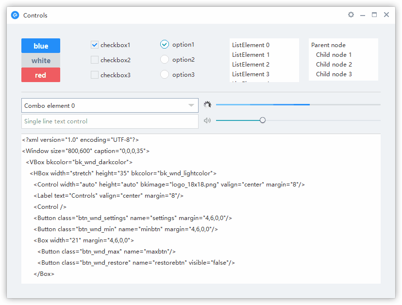

# NIM Duilib

NIM Duilib is a UI development framework for Windows, extend some new features based on the original [Duilib](https://github.com/duilib/duilib). Integrated Google base library with threads/memory/closures. You can use this framework to develop any desktop application you want.


[](https://ci.appveyor.com/project/nmgwddj/nim-duilib-framework)

[中文介绍](README.md)

## Features

 - Multi language support
 - Global style support
 - DPI scaling support
 - GIF animation support
 - CEF control support（based on CEF 2623, support XP）
 - Touch device support（surface, wacom）
 - Abstract rendering interface (support for other rendering engines)

## Preview



## Start

Clone the repo into your disk.

```bash
git clone https://github.com/netease-im/NIM_Duilib_Framework
```

Enter the `NIM_Duilib_Framework/examples` directory，Open `examples.sln` with Visual Studio 2013 Update 5 or higher ，press `F7` to compile all projects.

## Documentation

 - [Getting Started](docs/GETTING-STARTED.md)
 - [Docs](docs/SUMMARY.md)
    
## Structure

├─`base` Base libraries.  
├─`bin` Examples output directories，include skin and language files and CEF dependencies.  
├─`docs` Documentation of Duilib.  
├─`duilib` Duilib core, depend on base project.  
├─`libs` Static library output directories, include CEF static library.  
├─`examples` Examples of Duilib.  
├─`third_party` Third party for CEF.  
├─`ui_components` UI components based on Duilib, such as `msgbox`,`toast`,`cef_control`  

## Communication

 - Question: Read the [Documentation](docs/SUMMARY.md) and [Examples code](examples/README.md) to help you.
 - Report: File a bug in GitHub issues.
 - Suggestion: Request a new feature in Github issues.
