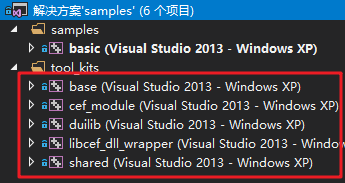
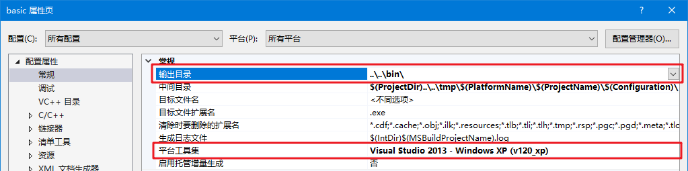
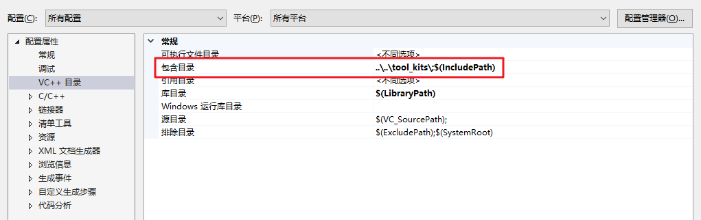
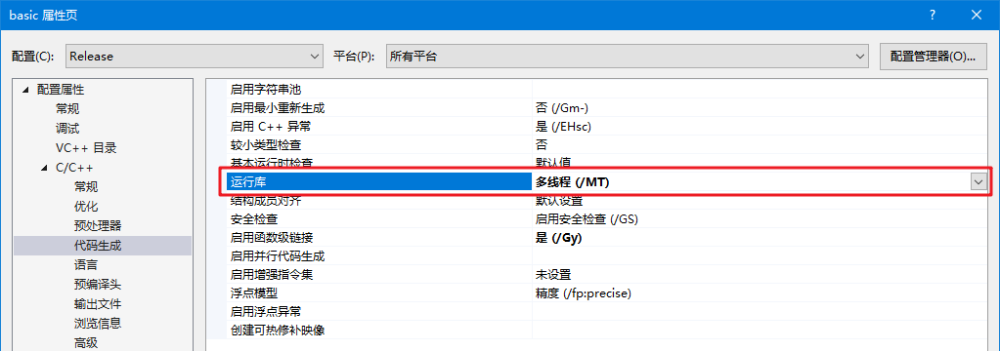
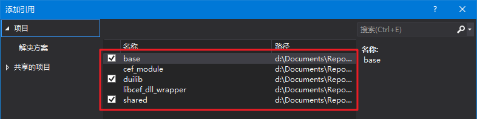
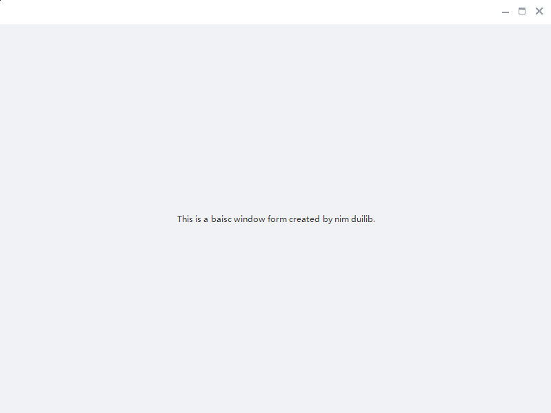

# 快速上手

此示例将引导你快速部署一个基于 duilib 的基本应用，此示例与 `samples` 中的 `basic` 项目一致，如果你更喜欢查看代码可以参考示例代码而无需多花费时间。

## 克隆项目

```bash
git clone https://github.com/netease-im/NIM_Duilib_Framework
```

## 创建基础工程

使用 Visual Studio 打开克隆后目录中 `samples\\samples.sln` 解决方案，
解决方案中包含了一些简单示例作为参考，你可以参考示例或新建一个 Windows 桌面应用，来一步一步完成第一个 duilib 窗口。

当新建一个 Windows 桌面程序（VS2017）后，将生成的代码清理一下只保留 wWinMain 函数。

```cpp
int APIENTRY wWinMain(_In_ HINSTANCE hInstance,
                     _In_opt_ HINSTANCE hPrevInstance,
                     _In_ LPWSTR    lpCmdLine,
                     _In_ int       nCmdShow)
{
    UNREFERENCED_PARAMETER(hPrevInstance);
    UNREFERENCED_PARAMETER(lpCmdLine);

    return 0;
}
```

## 配置项目属性

将 tool_kits 目录下的 base、shared、duilib 工程加入到解决方案中。



项目属性->常规，修改输出目录为克隆后项目的 bin 目录下

项目属性->常规，修改平台工具集与你编译的 duilib 保持一致



项目属性->VC++ 目录->包含目录中，添加 `tool_kits` 目录到包含目录中。如果你需要使用 CEF 模块请记得引入 `third_party\cef_wrapper` 目录



项目属性->C/C++->代码生成，将 Debug 模式的运行库修改为 `/MTd`，将 Release 模式的运行库修改为 `/MT`



项目右键->添加->引用，将 base、shared、duilib 作为引用项目，这样就不需要手动引入静态库文件了。



## 引入头文件

在 stdafx.h 中引入所需的头文件

```cpp
// base header
#include "base/base.h"

// shared project
#include "shared/shared.h"

// duilib
#include "duilib/UIlib.h"
```

## 引入线程库

在创建的项目中 wWinMain 所属的头文件中，增加自定义的主线程对象。

```cpp
class MainThread : public nbase::FrameworkThread
{
public:
	MainThread() : nbase::FrameworkThread("MainThread") {}
	virtual ~MainThread() {}

private:
	/**
	* 虚函数，初始化主线程
	* @return void	无返回值
	*/
	virtual void Init() override;

	/**
	* 虚函数，主线程退出时，做一些清理工作
	* @return void	无返回值
	*/
	virtual void Cleanup() override;
};
```

在 wWinMain 的下面增加主线程对象的方法实现，在这里初始化 duilib

```cpp
void MainThread::Init()
{
	nbase::ThreadManager::RegisterThread(kThreadUI);

	// 获取资源路径，初始化全局参数
	// 默认皮肤使用 resources\\themes\\default
	// 默认语言使用 resources\\lang\\zh_CN
	// 如需修改请指定 Startup 最后两个参数
	std::wstring theme_dir = QPath::GetAppPath();
	ui::GlobalManager::Startup(theme_dir + L"resources\\", ui::CreateControlCallback(), false);
}

void MainThread::Cleanup()
{
	ui::GlobalManager::Shutdown();
	SetThreadWasQuitProperly(true);
	nbase::ThreadManager::UnregisterThread();
}
```

在 wWinMain 实例化主线程对象，并调用执行主线程循环，添加后 wWinMain 函数修改如下：

```cpp
int APIENTRY wWinMain(_In_ HINSTANCE hInstance,
					 _In_opt_ HINSTANCE hPrevInstance,
					 _In_ LPWSTR    lpCmdLine,
					 _In_ int       nCmdShow)
{
	UNREFERENCED_PARAMETER(hPrevInstance);
	UNREFERENCED_PARAMETER(lpCmdLine);

	// 创建主线程
	MainThread thread;

	// 执行主线程循环
	thread.RunOnCurrentThreadWithLoop(nbase::MessageLoop::kUIMessageLoop);

	return 0;
}
```

## 创建一个简单窗口

创建一个窗口类，继承 `ui::WindowImplBase` 类，并覆写 `GetSkinFolder` `GetSkinFile` `GetWindowClassName` 三个方法。

```cpp
class BasicForm : public ui::WindowImplBase
{
public:
	BasicForm();
	~BasicForm();

	/**
	 * 一下三个接口是必须要覆写的接口，父类会调用这三个接口来构建窗口
	 * GetSkinFolder		接口设置你要绘制的窗口皮肤资源路径
	 * GetSkinFile			接口设置你要绘制的窗口的 xml 描述文件
	 * GetWindowClassName	接口设置窗口唯一的类名称
	 */
	virtual std::wstring GetSkinFolder() override;
	virtual std::wstring GetSkinFile() override;
	virtual std::wstring GetWindowClassName() const override;

	/**
	 * 收到 WM_CREATE 消息时该函数会被调用，通常做一些控件初始化的操作
	 */
	virtual void InitWindow() override;

	/**
	 * 收到 WM_CLOSE 消息时该函数会被调用
	 */
	virtual LRESULT OnClose(UINT uMsg, WPARAM wParam, LPARAM lParam, BOOL& bHandled);

	static const std::wstring kClassName;
};
```

```cpp
#include "stdafx.h"
#include "basic_form.h"

const std::wstring BasicForm::kClassName = L"Basic";

BasicForm::BasicForm()
{
}


BasicForm::~BasicForm()
{
}

std::wstring BasicForm::GetSkinFolder()
{
	return L"basic";
}

std::wstring BasicForm::GetSkinFile()
{
	return L"basic.xml";
}

std::wstring BasicForm::GetWindowClassName() const
{
	return kClassName;
}

void BasicForm::InitWindow()
{
	// 做一些初始化工作
}

LRESULT BasicForm::OnClose(UINT uMsg, WPARAM wParam, LPARAM lParam, BOOL& bHandled)
{
	PostQuitMessage(0L);
	return __super::OnClose(uMsg, wParam, lParam, bHandled);
}
```

## 创建窗口描述 XML 文件

在我们创建的窗口类中，指定了窗口描述文件目录是 `basic`，指定窗口的描述文件为 `basic.xml`。
接下来在 `resources\\themes\\default` 目录下创建 `basic` 文件夹并新建一个 `basic.xml` 文件，写下如下内容。

```xml
<?xml version="1.0" encoding="UTF-8"?>
<Window size="800,600" caption="0,0,0,35">
  <VBox bkcolor="bk_wnd_darkcolor">
    <HBox width="stretch" height="35" bkcolor="bk_wnd_lightcolor">
      <Control />
      <Button class="btn_wnd_min" name="minbtn" margin="4,6,0,0"/>
      <Box width="21" margin="4,6,0,0">
        <Button class="btn_wnd_max" name="maxbtn"/>
        <Button class="btn_wnd_restore" name="restorebtn" visible="false"/>
      </Box>
      <Button class="btn_wnd_close" name="closebtn" margin="4,6,8,0"/>
    </HBox>
    <Box>
      <VBox margin="0,0,0,0" valign="center" halign="center" width="auto" height="auto">
        <Label name="tooltip" text="This is a baisc window form created by nim duilib."/>
      </VBox>
    </Box>
  </VBox>
</Window>
```

## 显示窗口

在主线程的 Init 方法中，创建窗口并居中显示，创建窗口前先引入窗口的头文件，修改后的代码如下：

```cpp
void MainThread::Init()
{
	nbase::ThreadManager::RegisterThread(kThreadUI);

	// 获取资源路径，初始化全局参数
	// 默认皮肤使用 resources\\themes\\default
	// 默认语言使用 resources\\lang\\zh_CN
	// 如需修改请指定 Startup 最后两个参数
	std::wstring theme_dir = QPath::GetAppPath();
	ui::GlobalManager::Startup(theme_dir + L"resources\\", ui::CreateControlCallback(), false);

	// 创建一个默认带有阴影的居中窗口
	BasicForm* window = new BasicForm();
	window->Create(NULL, BasicForm::kClassName.c_str(), WS_OVERLAPPEDWINDOW & ~WS_MAXIMIZEBOX, 0);
	window->CenterWindow();
	window->ShowWindow();
}
```

这样一个简单的带有最小化、最大化、还原和关闭按钮、具有阴影效果和一行文字提示的窗口就创建出来了，你可以编译运行以下代码看一看窗口效果。

